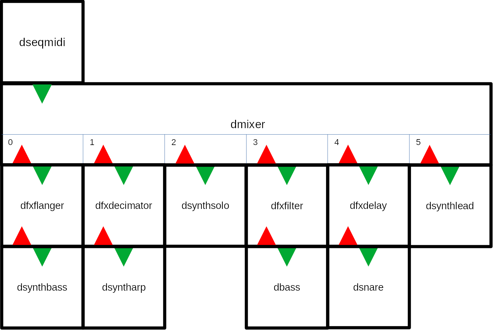

# Welcome to DStudio

Welcome to the DStudio – make music with code!

DStudio builds upon the DSP library DaisySP from Electro-smith. DStudio provides another abstraction layer where you don't focus on soundstreams and sample rates but on synthesizers, mixers, plugins and sequencers. Like a studio made with code!

DStudio is:

- DaisySP – DaisySP, a DSP library originally created for the Daisy Seed family of audio oriented hardware, now ported to work with rtAudio.
- DStudio – a set of classes which builds upon the DaisySP library, that gives you synthesizers, a sample player, drum sounds, FX plugins, a mixer with FX and sequencers as well as utilities. All can be controlled by MIDI.
- examples – examples that shows you how to use DStudio.

If you find any bugs or have suggestions for improvements, please contact me.

Author: Staffan Melin, staffan.melin@oscillator.se

License: GNU General Public License v3.0. DaisySP is licensed under the MIT license.

DaisySP: Electro-smith, license and source info TODO.  Thank you Electro-smith for making this!

Project site: http://oscillator.se/opensource

Source: https://github.com/StaffanMelin/dstudio


## Contents

- Installation
- Program strcture
- Basic tutorial
- Class reference
- Examples


## Installation

### Preparations

You need (at least, only tested on GNU/Linux Debian 11-12):

- build-essential
- make
- libsndfile1

Add RtAudio support:

`sudo apt install libasound2 libasound2-data libasound2-dev`

`sudo apt install libevent-dev`

They also installs necessary dependencies.

Note. On my current Debian Trixie several of these package have a version ending as well as "t64" in their names. 

### Build examples

Install all files in a directory.

In a terminal, enter an example directory and type `make` to build it.

Run the example: `./dstudio`


## Program structure

TODO

The header file dstudio.h is a global settings file that contains some common settings, most notably

```#define MIXER_CHANNELS_MAX 16```

which determines the max number of channels in the mixer, DMixer. You can run one sound object on each channel, but all channels can be a mixer so you can chain an infinite number of sounds.

### Structure

rtaudio init
command line arg

functions for setup, init
and process, called in...

ACB
calls sound generating object
The Process() method is called for each object to make do its work (produce sound).

control loop in main
generate control data, such as notes, in for ex midi

### Object configuration

TODO config, .h files

All DStudio instruments are configured using a struct. They are quite similar and the easiest way to understand them is by looking a the examples and study the header files.

All objects follow the same pattern. You create a configuration struct, set it up and pass it to the Init() method. TODO Setup()

If you are using the mixer it will take care of calling all sound generating objects for you.

All classes derived from DSound can be of different types and have a get and set method for working with this: GetType() and SetType():

- TUNED - used and set as default for all tuned instruments, ie synths
- PERCUSSION - used and set as default for all drum sounds
- FX - used and set as default for all FX plugins
- MIXER - analyses the incoming MIDI and sends it to the channel indicated by (in) the MIDI message
- MIXER_SUB - a submixer is a mixer put on one channel of the main mixer. When a DMixer of this type receives a MIDI message it sends it to all instruments on every channel. Use this to build fat patches.
- MIXER_PERCUSSION - looks at incoming MIDI and sends it on to the channel indicated by the NOTE value - 36 (the 36 comes from the constant MIDI_PERCUSSION_START defined in dstudio.h. This way you can create a drum set using a DMixer of type MIXER_PERCUSSION.


## Basic tutorial

TODO: change this old example

Lets create a subtractive synthesizer that you can play on the computer keyboard.

Let us start with example-00.

Edit the ofApp.h file. Delete the methods we don't need. Add the basic necessary includes, a DSynthSub object, the audioOut() method and a ofSoundStream object.

code

Edit the ofApp.c file. Delete the methods we don't need. Add the basic necessary includes, the soundstream configuration, the DSynthSub object configuration, start the ofSoundStream object. Add content for the audioOut() method and the keyPressed() and keyReleased() methods.

```code for setup```

```

void ofApp::keyPressed(int key)
{
    if ((key > 30) && (key < 130))
    {
        note = key - 30;
        dsynthsub.MidiIn(MIDI_MESSAGE_NOTEON, note, 70);
    }
}

void ofApp::keyReleased(int key)
{
    dsynthsub.MidiIn(MIDI_MESSAGE_NOTEOFF, note, 0);
}

void ofApp::exit()
{
    ofSoundStreamClose();
}
```

Press the keys on your keyboard to make some sounds!


## Class reference

DStudio is a collection of classes. The majority of them create sounds and are all derived classes of the DSound class:

- classic synthesizers:
    - DSynthSub: a classic subtractive, virtual analog, two oscillator synth
    - DSynthFm: an FM synth
    - both with portamento, filters, envelopes for pitch, filter, amplitude, an LFO that can affect pitch, filter, amplitude, delay and overdrive

- an experimental synthesizer: DSynthVar, a variable shape synth, with filter, envelopes and unique modulations with different random modes as well as a modulation sequencer, delay and distortion  

- a sampler: DSampler, with filter, envelopes, LFO, delay and distortion

- individual drum sounds: DBass, DClap, DCymbal, DDrum, DHihat and DSnare, most of them with three different sound generating algorithms, all with lots of options for shaping the sound

They can be combined using the mixer class DMixer. The mixer can pan and adjust levels of all channels, as well as providing two send channels for reverb and chorus.

You can use the sequencer, DSeqMidi, to sequence them. Or you can use and control them directly in your code.

You can also use the permutating sequencer DSeqPerm. Feed it with sequences and let it provide you with ever changing results!

For details on how to use the classes, see the corresponding header files and the example projects.

### Instruments

The synthesizers and the sampler have their own sound generation methods, but here are the features that are common to them all (with some exceptions to the DSynthVar which has more flexible types of modulation). 

They are all initialized using a config struct with the following common members: TODO

- float sample_rate: set this to the global settings DSTUDIO_SAMPLE_RATE
- uint8_t voices: maximum number of polyphony
- float tune: detuning in hertz
- uint8_t transpose: MIDI transpose value
- float osc_level: level of oscillator (or oscillators)
- float noise_level: level of white noise (0.0 - 1.0)
- FilterType filter_type: the filter can be BAND, HIGH, LOW, NOTCH, PEAK or PASSTHROUGH (no filter)
- float filter_res: filter resonance (0.0 - 1.0)
- float filter_cutoff: filter cutoff frequency (should go no higher than half the sample frequency, ie DSTUDIO_FILTER_BASE (defined in dstudio.h)


- float eg_p_level: how much should the pitch envelope affect the pitch (0.0 - 1.0)
- float eg_p_attack: time (in seconds) to go from 0 to 1.0
- float eg_p_decay: time to go from 1.0 to sustain
- float eg_p_sustain: level of sustain ("holding down a key")
- float eg_p_release: time to go from sustain to 0
- float eg_f_level: how much should the filter envelope affect the cutoff frequency (0.0 - 1.0)
- float eg_f_attack: time (in seconds) to go from 0 to 1.0
- float eg_f_decay: time to go from 1.0 to sustain
- float eg_f_sustain: level of sustain ("holding down a key"); if this is 0.0 and the filter is LOW no sound will possibly be heard
- float eg_f_release: time to go from sustain to 0
- float eg_a_attack: time (in seconds) to go from silent to 1.0
- float eg_a_decay: time to go from 1.0 to sustain
- float eg_a_sustain: level of sustain ("holding down a key")
- float eg_a_release: time to go from sustain to 0
- Waveform lfo_waveform: waveform of the LFO: WAVE_SIN, WAVE_TRI, WAVE_SAW, WAVE_RAMP, WAVE_SQUARE, WAVE_POLYBLEP_TRI, WAVE_POLYBLEP_SAW, WAVE_POLYBLEP_SQUARE
- float lfo_freq: frequency of LFO in hertz
- float lfo_amp: amplitude of LFO (0.0 - 1.0+)
- float lfo_p_level: how much should the LFO affect the pitch (0.0 - 1.0+)
- float lfo_f_level: how much should the LFO affect the filter (0.0 - 1.0+)
- float lfo_a_level: how much should the LFO affect the amplitude (0.0 - 1.0+)
- float portamento: portamento time (in seconds to reach half the distance), works best when voices_ is 1
- float delay_delay: delay time (seconds)
- float delay_feedback: feedback level (0.0 - 1.0)
- float overdrive_gain: overdrive gain (0.0 - 1.0), it is usually good to reduce the gain when applying overdrive drive.
- float overdrive_drive: overdrive drive (0.0 - 1.0)

### Presets

You can now save and load presets of all synthesizers and drums using the DSettings static class. They are stored as XML files.

TODO

You must use settings for this to work.

There is no error checking on loading presets.

### DSynthSub
A classic virtual analog subtractive synth with two oscillators, noise, a selectable filter, an EG, a LFO that can control amplitude, filter or pitch, portamento, delay and overdrive FX.

Additional properties:

- Waveform waveform0; waveform of oscillator 0: WAVE_SIN, WAVE_TRI, WAVE_SAW, WAVE_RAMP, WAVE_SQUARE, WAVE_POLYBLEP_TRI, WAVE_POLYBLEP_SAW, WAVE_POLYBLEP_SQUARE
- Waveform waveform1; waveform of oscillator 1: WAVE_SIN, WAVE_TRI, WAVE_SAW, WAVE_RAMP, WAVE_SQUARE, WAVE_POLYBLEP_TRI, WAVE_POLYBLEP_SAW, WAVE_POLYBLEP_SQUARE
- float detune: a detune parameter which controls the interval between the two oscillators. Set it to 12.0 for a whole octave
- float osc0_level: level of oscillator 0 (0.0 - 1.0)
- float osc1_level: level of oscillator 1 (0.0 - 1.0)

### DSynthFm

Like the DSynthSub but with FM at its heart.

Additional properties:

- float ratio: ratio between modulator and carrier signal
- float index: FM depth

### DSynthVar

Variable wave shape synthesizer.

Additional properties:

- float waveshape: 0 is saw/ramp/tri, 1 is square
- float pulsewidth: pulsewidth when shape is square. Saw, ramp, tri otherwise
- bool sync_enable: whether or not to sync the oscillators
- float sync_freq: sync oscillator freq in Hz

Because this is mostly cool when you can modulate this, the DSynthVar has a more flexible modulation system.

Available modulators:

- 3 EGs (ADSR)
- 3 LFOs
- 3 SM (special modulators)

Additional properties that tell DSynthVar which modulators affect the different parameters. They can all be set to one of the constants defined in dsynthvar.h:

```
#define DSYNTHVAR_MOD_NONE 0
#define DSYNTHVAR_MOD_EG0 1
#define DSYNTHVAR_MOD_EG1 2
#define DSYNTHVAR_MOD_EG2 3
#define DSYNTHVAR_MOD_LFO0 4
#define DSYNTHVAR_MOD_LFO1 5
#define DSYNTHVAR_MOD_LFO2 6
#define DSYNTHVAR_MOD_SM0 7
#define DSYNTHVAR_MOD_SM1 8
#define DSYNTHVAR_MOD_SM2 9
```

Properties:

- uint8_t mod_eg_p: pitch envelope modulator
- uint8_t mod_eg_f: filter envelope modulator
- uint8_t mod_eg_a: amplitude envelope modulator
- uint8_t mod_filter_cutoff: filter cutoff frequency modulator
- uint8_t mod_waveshape: waveshape modulator
- uint8_t mod_pulsewidth: pulsewidth modulator
- uint8_t mod_sync_freq: sync oscillator frequency modulator. Works best when set to same modulator as pitch envelope.
- uint8_t mod_delay: delay modulator (this can produce some spacey effects)

The DSynthVar can use 3 Special Modulators (see dsm.h and dsm.cpp). How they use the proprties depend on the type.

#### SM: Noise (DSTUDIO_SM_TYPE_NOISE)

White noise signal (0.0 - 1.0).

Properties:

- float sm_0_freq: frequency of signal change.
- float sm_0_amp: amplitude of signal (0.0 - 1.0)
- float sm_0_offset: offset added to signal (0.0 - 1.0)
- uint8_t sm_0_seq_len: not used
- std::vector<float> sm_0_seq_val: not used
SM: Crawl (DSTUDIO_SM_TYPE_CRAWL)
Signal moves ("crawls") from a value to the next (0.0 - 1.0).
Properties:
- float sm_0_freq: frequency of signal change.
- float sm_0_amp: how much to change each step (0.0 - 1.0)
- float sm_0_offset: probability the signal will not change (0.0 - 1.0)
- uint8_t sm_0_seq_len: not used
- std::vector<float> sm_0_seq_val: not used

#### SM: Interval (DSTUDIO_SM_TYPE_INTERVAL)

Outputs signal or zero at random intervals (0.0 - 1.0).

Properties:

- float sm_0_freq: frequency of signal change.
- float sm_0_amp: amplitude of signal to output (0.0 - 1.0)
- float sm_0_offset: probability the signal will not change (0.0 - 1.0)
- uint8_t sm_0_seq_len: not used
- std::vector<float> sm_0_seq_val: not used

#### SM: Chaos (DSTUDIO_SM_TYPE_CHAOS)

Outputs random signal at random intervals (0.0 - 1.0).

Properties:
- float sm_0_freq: frequency of signal change.
- float sm_0_amp: max amplitude of signal to output (0.0 - 1.0)
- float sm_0_offset: probability the signal will not change (0.0 - 1.0)
- uint8_t sm_0_seq_len: not used
- std::vector<float> sm_0_seq_val: not used

#### SM: Sequencer (DSTUDIO_SM_TYPE_SEQ)

Outputs signal defined in sequence (0.0 - 1.0).

Properties:

- float sm_0_freq: frequency of signal change.
- float sm_0_amp: not used
- float sm_0_offset: not used
- uint8_t sm_0_seq_len: length of sequence
- std::vector<float> sm_0_seq_val: vector of values to output (0.0 - 1.0)

#### DC offset

This synthesizer can introduce a DC offset into the signal. It helps to insert a high pass filter before the DSynthVar. (See demo 3, 7 and 8.)

### DSampler

A sample player that uses linear interpolation for pitch changes. 

Tuned to A 440Hz but this can be set with the constant DSAMPLER_BASE_FREQ (dsampler.h).

The DSampler need libsndfile (http://www.mega-nerd.com/libsndfile/api.html) and uses dynamic memory to load the sample.

It can handle both stereo and mono samples at 44100 hz.

Additional properties:

- bool loop: to loop (true) or not loop (false) the sample
- std::string sample_file_name;
- uint32_t sample_length_: length of sample
- uint32_t sample_phase_start_: start of sample (0)
- uint32_t sample_phase_loop_start_: start of loop (0)
- uint32_t sample_phase_loop_end_: end of loop (0)
- uint32_t sample_phase_end_: end of sample (length of sample)
- uint8_t sample_channels_: mono (1) or stereo (2)


The variables sample_phase_start, sample_phase_loop_start, sample_phase_loop_end, sample_phase_end and sample_length are set in DSampler::Load(). They are set to play and loop the whole sample. To avoid this, for example when loading a preset, pass false as the second parameter to Load() -- which is what you normally should do. If you want to base these parameters on the sample itself, pass true.

You load a sample using the Load() method:
```
dsampler.Load("data/test.wav");
```
You can use an absolute path or a relative path (for the oF examples relative to the bin directory).

Sample size is limited by the constant SAMPLE_BUFFER_MAX defined in dsampler.h

### Drum instruments

All drum sounds have a lot of sound shaping properties. See the header files and examples.

Drum sounds respond to MIDI pitch values.

All drum instruments can also load presets.

#### DBass

Bass drum, with three different sound engines (type): analog (808, DTYPE_ANALOG), synthetic (909, DTYPE_SYNTHETIC) and opd (my home cooked engine, DTYPE_OPD).

#### DSnare

Snare. Like the bass drum it has three types.

#### DClap
Home cooked clap sound.

#### DCymbal

Use it for ride and crash sounds.

#### DDrum

A kind of tuned drum that can be used for things like toms.

#### DHihat

Open and closed hihat with three different sound engines like the bass and snare.

### DFX

The DFX "plugins" can be used to enhace any DSound sound source. You can chain several plugins.

A DFX plugin passes MIDI straight through, process the child sound, adds fx and returns the modified signal. The child sound source is always called as a stereo source.

#### How to use a DFX plugin

Here is an example on how to add a DFXFlanger to a DSynthSub synthesizer (from demo 3).

TODO

Create a sound source (a DSynthSub):

```
dsynth_config.sample_rate = settings.sampleRate;
dsynth_config.voices = 6;
dsynth_config.waveform0 = DSynthSub::WAVE_SAW;
...
dsynthbass.Init(dsynth_config);
Create the DFXFlanger plugin and add the DSynthSub as a child:
// flanger on bass pad
DFXFlanger::Config dfxflanger_config;
dfxflanger_config.sample_rate = settings.sampleRate;
dfxflanger_config.level = 0.8f;
dfxflanger_config.feedback = 0.7f;
dfxflanger_config.lfo_depth = 0.8f;
dfxflanger_config.lfo_freq = 0.3f;
dfxflanger_config.delay = 0.8f;
dfxflanger_config.child = &dsynthbass;
dfxflanger.Init(dfxflanger_config);
```

Add it to the DMixer:

```
dmix_synth[0] = &dfxflanger;
```

When the DMixer's Process() method is called, it will call the DFXFlanger plugin which in turn will call the child, the DSynthSub plugin.


All DFX plugins can be found in the dfx.cpp and dfx.h files.

Common properties in config struct:

- float sample_rate: set this to the global settings DSTUDIO_SAMPLE_RATE
- float level: output level of plugin (0.0 -)
- DSound *child: connected child DSound sound source

#### Decimator

A decimator with bitcrush.

Additional properties in config struct:

- float downsample_factor: amount of downsample (0.0 - 1.0)
- float bitcrush_factor: amount of bitcrushing (0.0 - 1.0)
- uint8_t bits_to_crush: the number of bits to crush (0 - 16)

#### Delay

Stereo delay, can also be used for "ping pong" effects. Useful for drums that unlike the DSynth* don't have it built in.

Additional properties in config struct:

- float delay_delay_l; delay time left channel (seconds)
- float delay_feedback_l; feedback level left channel (0.0 - 1.0)
- float delay_delay_r; delay time right channel (seconds)
- float delay_feedback_r; feedback level right channel (0.0 - 1.0)

#### Filter

A filter with different modes of the same type as the filter in DSynth*.

Additional properties in config struct:

- FilterType filter_type_: the filter can be BAND, HIGH, LOW, NOTCH, PEAK or PASSTHROUGH (no filter)
- float filter_res_: filter resonance (0.0 - 1.0)
- float filter_cutoff_: filter cutoff frequency (should go no higher than half the sample frequency, ie DSTUDIO_FILTER_BASE (defined in dstudio.h)

#### Flanger

A flanger where a delayed signal is modulated using an LFO. This signal is added back (feedback) to the dry signal which results in a kind of changing filter effect.

Additional properties in config struct:

- float feedback: flanger feedback level (0.0 - 1.0)
- float lfo_depth: LFO depth (0.0 - 1.0)
- float lfo_freq: LFO frequency (0.0 - 1.0)
- float delay: delay time (0.0 - 1.0, maps to .1 to 7 ms)

#### Overdrive

Useful for drums that unlike the DSynth* don't have it built in.

Additional properties in config struct:

- float gain:  overdrive gain (0.0 - 1.0), it is usually good to reduce the gain when applying overdrive drive
- float drive: overdrive drive (0.0 - 1.0)

#### Panner

Panner is an autopanner with 3 modes (called types) and a built in LFO: 

- type == DFXPanner::STATIC: offset is pan value (0.0 - 1.0)
- type == DFXPanner::LFO: offset is added to the LFO signal 
- type == DFXPanner::RANDOM: A new random value is generated when the LFO has changed more than the offset value. Amplitude is the width of generated values.

Panner is a stereo effect that preferably operates on mono DSounds.

#### Slicer

The slicer samples a random length of the audio, and repeats it random times, then starts anew.

TODO

#### Tremolo

A tremolo that rhythmically changes the amplitude of the signal.

Additional properties in config struct:

- float freq: frequency in hertz
- uint8_t waveform: waveform of amplitude change, can be WAVE_SIN, WAVE_TRI, WAVE_SAW, WAVE_RAMP, WAVE_SQUARE, WAVE_POLYBLEP_TRI, WAVE_POLYBLEP_SAW, WAVE_POLYBLEP_SQUARE,
- float depth: depth of tremolo (0.0 - 1.0)


### DMixer

This is the mixer. It handles incoming MIDI, distributes it to the right channel, and calls all sound generating objects and all channels, adds FX and produces a stereo signal.

It takes a number of arrays with settings, most notably the sound generators (synthesizers and drum sounds), apply optionally chorus and reverb, then pan and adjust the level for each sound/channel.

DMixer is also a DSound object. This means that you can use it as a channel in the mixer, chaining mixers and sound generators as much as your memory and CPU can handle!

MIDI pan and level messages are handled by DMixer, the rest is sent to the correct channel.


#### Built-in effects: Reverb and chorus

Every channel can have a specific amount sent to a global reverb and/or chorus. The amount for every channel is provided by the reverb_level and chorus_level arrays.

The mixer config struct has three members that control how much FX is sent back to the main mix:

- float chorus_return - typical value 0.5
- float reverb_return - typical value 0.5
- float mix_dry - typical value 0.5

### DSeqMidi

A MIDI sequencer that sequences tracks and has a song, ie sequences chaining, capability.

This is a sequencer that you feed with data in vectors.

You can use MIDI values or the shortcuts defined in dseq.h:

- DTx. Length of notes or sequences. DT1 = one whole bar, DT2 = a half bar, DT4 = a quarter bar/note etc.
- DEx. Sequence event. DEN is Note on.
- DVx. Velocity (volume). DV1 to 10 equals MIDI velocity from 10 to 100. DVMAX is max velocity, 127. DVOFF is "turn note off". A velocity of 0 is always Note off.

#### Song data (dmidisong_t)

A vector describing which sequences each channel should play on a song step. Each song step is a vector, eg

```
{{0, DT1 * 8}, {5, DT1}, {5, DT1 * 8}, {3, DT1}, {5, DT1}},
```

This line describes one step in a song. Channel 0 should play sequence 0, for 8 bars, channel 1 should play sequence 5 for one bar etc. The duration of a song step is equal to the length of the longest sequence, in this case DT1 * 8 = 8 bars. Shorter sequences are repeated.

#### Sequence data (dmidiseq_t)

A vector describing the MIDI events in each sequence. Eg
```
        {
            {0, DEN, 31, DV7},
            {0, DEN, 38, DV7},
            {0, DEN, 43, DV7},
            {DT1*4, DEN, 38, DVOFF},
            {DT1*4, DEN, 39, DV7},
            {DT1*4, DEN, 36, DV7},
            ...
        },
```

At tick 0, start playing (DEN) note 31 (MIDI pitch number) with velocity 70 (DV7), note 38 with velocity 70 and note 43. Four bars later (at position DT1*4) stop playing note 38, and start playing note 39 and 36. Note 31 will still be playing as it hasn't been turned off (DEN event with velocity DVOFF).

You can also send Cutoff and Resonance CCs.

Sequences with no notes should be defined as empty vectors:
```
        { // 2 bass2 verse
            {}
        }
```

#### Drum data

If you create a drum machine using a DMixer object of type MIXER_PERCUSSION, you can use the pitch value to control which drum sound will be played.

Use the constants defined in dstudio.h. The DMixer will subtract MIDI_PERCUSSION_START from all pitch values it receives and then send the MIDI to the channel with the resulting value.

Eg a note with pitch value DESNARE will be sent to channel 1 of the DMixer. 

### DSeqPerm

This is a MIDI sequencer that can permutate the music played, ie manipulate the note data in individual sequences and mute/unmute channels. It creates automatic remixes of your songs!

It also works differently than the DMidiSeq under the hood, creating a MIDI queue of events.

#### Sequence data (dmidiseqin_t)

Event (note) data doesn't use Note off events. Instead, you specify the length of the note and a Note off event will automatically be generated.

```
        { // 1 bass1 verse
            {DT1*0+DT16*0, DEN, 38, DV10, DT16*1},
            {DT1*0+DT16*3, DEN, 38, DV10, DT16*2},
        ...
        }
```

At tick 0, play note 38 for a duration of 1/16. At tick 3*1/16 play note 38 for a duration of 2*1/16.
For drum data you use the duration constant DTD.

#### Permutations (changes)

The strength parameter in the config-structure decides how forcefully the sequencer should change music. It is a float that gives the probability of a change occuring. Permutations are performed at each song step.

The permutations (changes) that can happen are:

- PERMUTATE_SWAP - swap pitch values with another note in the sequence
- PERMUTATE_RHYTHM - swap length with another note in the sequence
- PERMUTATE_SIMPLIFY - remove note from the sequence
- PERMUTATE_ADD - add a note by repeating an already existing note
- PERMUTATE_SHIFT - shift sequence in time
- PERMUTATE_TRANSPOSE - transpose sequence to other pitches used
- PERMUTATE_ORIGINAL - revert back to the original sequence

How large these changes will be and the number of notes affacted depends on the strength parameter.

In addition, the sequencer can also mute/unmute channels depending on the strength parameter.

### DGen

This is an example class of how to make generative music. The implemented class is called DGenDrone.
It creates never ending music based on simple MIDI note input and random changes.

Channels can be of different types that affect how notes for that channel is generated:

- DGenDrone::BASS: low droning notes
- DGenDrone::TREBLE: high droning notes
- DGenDrone::PAD: chords
- DGenDrone::MELODY: melody
- DGenDrone::ARPEGGIO: arpeggio
- DGenDrone::EMBELLISH: quick details

The DGenDrone class works on some note input:

- dgen_note_base: a vector with the base MIDI note of each channel
- dgen_note_pad: notes that are used for the channel type PAD. The values are relative to the base note for the channel.
- dgen_note_arp: notes that are used for the channel type ARPEGGIO. The values are relative to the base note for the channel.
- dgen_note_melody: notes that are used for the channel type MELODY. The values are relative to the base note for the channel

The algorithm uses states, called *drama*; INTRO, VERSE, CHORUS, BREAK, OUTRO.

The DGenDrone::NoteCreate() method creates notes for a specific channel type and drama state. Notes are queued and sent when the time is right.

Transitions from one drama state to another is handles by a drama_order_ vector, indexed on drama state with three values that indicates which transitions are possible (with 60%, 30% and 10% probability respectively).

Every channel can have a drama_fade_ value. This indicates how long (in specified fraction of drama length) should be used for a fade in or fade out.

See example-10-generative-space-music. 

### DSplit

A DSplit object is a kind of MIDI splitter. It works a bit like a mixer in that you attach several sound generating objects to different channels. You specify which MIDI pitch intervals should be sent to each channel.

In this example we have 4 DSampler objects. The DSplitInfo array tells the DSplit object to send MIDI notes up to 36 to channel 0 and add 36 to the MIDI pitch, send MIDI notes up to 48 to channel and add 24 etc. You can also use negative offsets.

```
    DSound *dsplit_synth[MIXER_CHANNELS_MAX];
    dsplit_synth[0] = &dsampler1;
    dsplit_synth[1] = &dsampler2;
    dsplit_synth[2] = &dsampler3;
    dsplit_synth[3] = &dsampler4;
    DSplitInfo dsplit_split[MIXER_CHANNELS_MAX];
    dsplit_split[0] = {36, 36, 0}; // end, offset, channel
    dsplit_split[1] = {48, 24, 1}; // end, offset, channel
    dsplit_split[2] = {60, 12, 2}; // end, offset, channel
    dsplit_split[3] = {72, 0, 3}; // end, offset, channel
    DSplit::Config dsplit_config;
    dsplit_config.sample_rate = settings.sampleRate;
    dsplit_config.channels = 4;
    dsplit_config.synth = dsplit_synth;
    dsplit_config.split = dsplit_split;
    dsplit.Init(dsplit_config);
```


Note that the DMixer input for DSplit must be stereo.


## Examples

A good way to learn to use DStudio is by running and studying the examples.

### Example 0

TODO

### Example 1 - Algorithmic

Algorithmic composition.

Demonstrates how to setup and use a bunch of different synthesizers and sounds, mix them together, and trigger them using the Metro timing class, feeding them various randomized data. A kind of algorithmic composition program.


### Example 02 - Drone

A drone experiment. In the main.cpp you can configure the number of drones

```
#define DRONES 16
```

Remember that the mixer handles 16 channels by default. If you create more drones you also have to increase the number of mixer channels in dstudio.h. I have successfully created 100 drones running at the same time (the number must fit in 8 bits).


### Example 03 - Sequencer

A sequenced song that shows how to create sequences and chain them into a song.



### Example 04 - Sampler

An example of using the DSampler class and the DSynthVar class.


### Example 07 - Synthpop

A sequenced synthpop song using DSeqMidi with DSampler providing vocals. 


### Example 08 Permutating electropop

An evolving electropop song using DSeqPerm and DSampler providing some electropop sounds.


### Example 10 - Generative space music

This is an example of how to make generative music using a DGen class.

It creates never ending music based on simple MIDI note input and random changes.

Channels can be of different types that affect how notes for that channel is generated:

- DGenDrone::BASS: low droning notes
- DGenDrone::TREBLE: high droning notes
- DGenDrone::PAD: chords
- DGenDrone::MELODY: melody
- DGenDrone::ARPEGGIO: arpeggio
- DGenDrone::EMBELLISH: quick details

The DGenDrone class works on some note input:

- dgen_note_base: a vector with the base MIDI note of each channel
- dgen_note_pad: notes that are used for the channel type PAD. The values are relative to the base note for the channel.
- dgen_note_arp: notes that are used for the channel type ARPEGGIO. The values are relative to the base note for the channel.
- dgen_note_melody: notes that are used for the channel type MELODY. The values are relative to the base note for the channel

The algorithm uses states, called drama; INTRO, VERSE, CHORUS, BREAK, OUTRO. The DGenDrone::NoteCreate() method creates notes for a specific channel type and drama state. Notes are queued and sent when the time is right.

Transitions from one drama state to another is handled by a drama_order_ vector, indexed on drama state with three values that indicates which transitions are possible (with 60%, 30% and 10% probability respectively).

Every channel can have a drama_fade_ value. This indicates how long (in specified fraction of drama length) should be used for a fade in or fade out.

The example also shows how to work with presets.

### Example 11 - Haxophone solo voice

#### Setting up on the Raspberry Pi with Haxophone

Install raspi lite

`sudo raspi-config`

* expand file system
* enable i2c
* gpio is already enabled

edit /boot/firmware/config.txt
```
# Enable audio (loads snd_bcm2835)
# dtparam=audio=on
dtoverlay=max98357a
```
TODO

#### Additional preparations for the haxophone

Add I2C support:

`sudo apt install libi2c-dev`

Test:

`i2cdetect -l`

Add GPIO support:

`sudo apt install libgpiod-dev`

Test:

- `gpiodetect`
- `gpioinfo`

### Example 12 - Haxophone with drone background

TODO

### Example 13 - Haxophone with space music background

TODO

### Example 15 - Touch screen drone

TODO